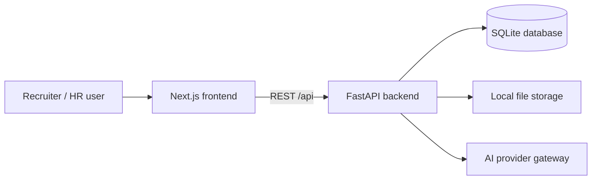
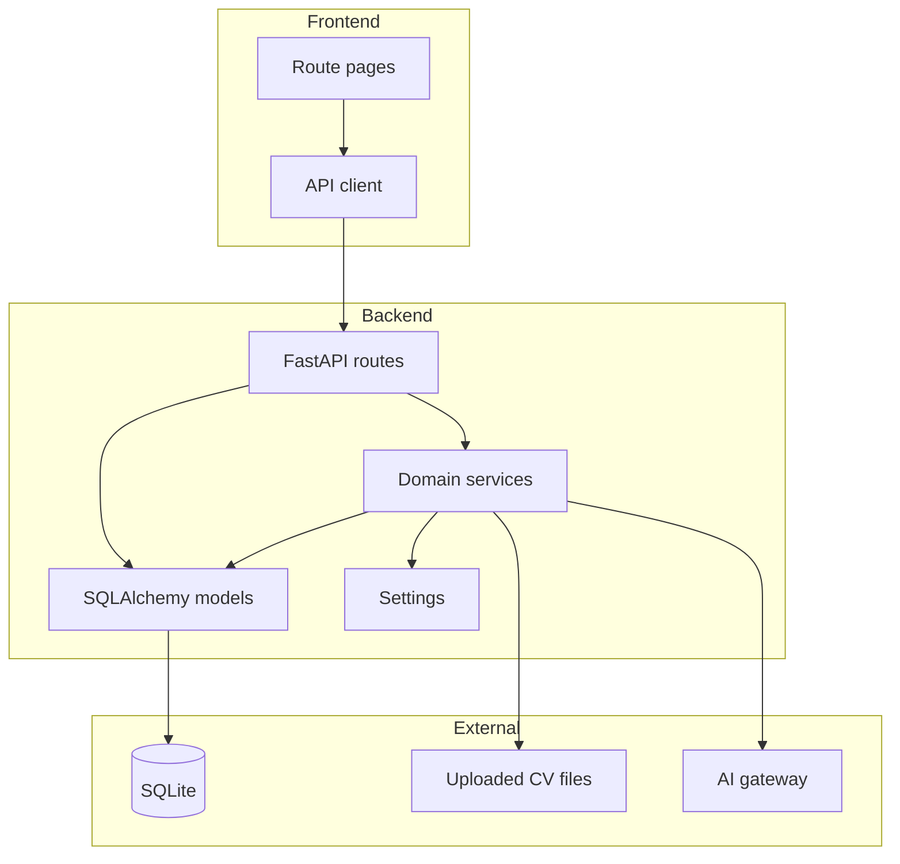

# Architecture

## Overview

`ai_screening_copilot` is a full-stack recruitment workflow application that helps recruiters:

- create job descriptions
- upload and parse CVs
- screen candidates against a job description using AI
- rank candidates
- generate interview questions
- export results to PDF and Excel

The system is intentionally simple for MVP use:

- a Next.js frontend provides the operator workflow
- a FastAPI backend owns business logic
- SQLite stores job descriptions, candidates, screenings, and interview questions
- the file system stores uploaded CV files
- an AI provider gateway performs screening and interview generation

## Runtime Topology

## Frontend Responsibilities

The frontend lives in `frontend/src/app` and is organized by route.

Main route groups:

- `/`
  Dashboard and operational overview
- `/job-descriptions`
  JD CRUD workflow
- `/candidates`
  CV upload and candidate review
- `/screening`
  Candidate-to-JD screening
- `/ranking`
  Ranked screening results
- `/interview`
  Interview question generation
- `/export`
  PDF and Excel downloads

Shared frontend responsibilities:

- page orchestration and UI state
- calling backend APIs through `frontend/src/lib/api.ts`
- rendering scores, tags, and summaries
- surfacing backend health/provider status

## Backend Responsibilities

The backend lives in `backend/app`.

Main layers:

- `api/v1`
  Route handlers and request/response orchestration
- `core`
  App config and database setup
- `models`
  SQLAlchemy ORM models
- `schemas`
  Pydantic request/response models
- `services`
  CV parsing, AI integration, and export logic

Key backend modules:

- `cv_parser.py`
  Extracts plain text from PDF and DOCX, then produces basic structured candidate data
- `ai_service.py`
  Selects the active AI provider and attaches provider metadata to AI results
- `ai_providers.py`
  Implements provider-specific screening and interview generation
- `export_service.py`
  Builds PDF and Excel exports

## Component Boundaries

## Data Ownership

- Frontend owns presentation state only
- Backend owns all business rules and persistence
- Database owns durable recruitment records
- File system owns raw uploaded CV binaries
- AI gateway owns inference only; its output is normalized and stored by the backend

## Important Design Decisions

### 1. SQLite-first persistence

The app uses SQLite for MVP simplicity and low setup cost. The schema is relational, so migration to PostgreSQL later is realistic.

### 2. AI provider abstraction

The AI layer supports multiple providers:

- Gemini
- OpenAI-compatible chat provider
- Claude
- Ollama native API

Provider switching is configuration-driven through environment variables.

### 3. Screening results are cached in the database

Each `(candidate_id, job_description_id)` pair stores a screening result. The backend now refreshes existing rows when:

- the previous result failed
- the stored provider/model metadata no longer matches the active runtime provider/model

This avoids stale AI errors lingering forever.

### 4. Canonical database path

The backend now resolves the database to `backend/screening.db` using an absolute SQLite URL so runtime behavior is stable regardless of which working directory starts the app.

## Deployment Shape

Current local deployment:

- backend started with Uvicorn on `http://localhost:8000`
- frontend started with Next.js on `http://localhost:3000`
- frontend calls backend using `NEXT_PUBLIC_API_URL`

Current backend health response:

- app name
- app version
- active AI provider
- active AI model

This is used by the frontend shell to show live runtime status.
