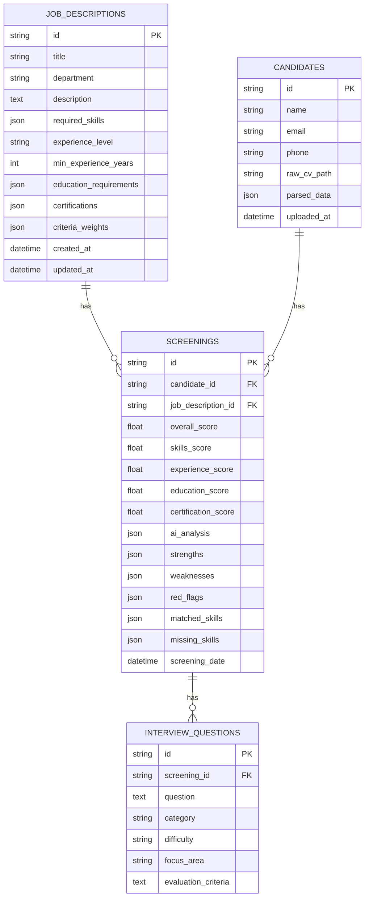

# Database

## Canonical Database File

The application now resolves SQLite to:

`backend/screening.db`

This is enforced through an absolute default `DATABASE_URL`, which prevents the app from accidentally creating different SQLite files depending on the current working directory.

## Entity Relationship Diagram



## Table Notes

### `job_descriptions`

Stores structured hiring criteria.

Important JSON columns:

- `required_skills`
- `education_requirements`
- `certifications`
- `criteria_weights`

### `candidates`

Stores candidate identity plus parsed CV content.

Important notes:

- `raw_cv_path` points to a file in the upload directory
- `parsed_data` keeps the extracted text and basic structured fields

### `screenings`

Stores the AI output for one candidate against one job description.

This table is the operational center of the product.

Important notes:

- one row represents one `(candidate_id, job_description_id)` pair
- `overall_score` is computed server-side from weighted dimensions
- `ai_analysis` stores the raw normalized AI result plus metadata
- `_meta.provider` and `_meta.model` inside `ai_analysis` help detect stale results

### `interview_questions`

Stores generated interview questions for one screening result.

Important notes:

- questions are cached after generation
- if a screening is refreshed, associated interview questions are deleted and can be regenerated

## Example JSON Structures

### `job_descriptions.required_skills`

```json
[
  {
    "name": "Python",
    "weight": 1.0,
    "required": true
  },
  {
    "name": "FastAPI",
    "weight": 1.0,
    "required": true
  }
]
```

### `job_descriptions.criteria_weights`

```json
{
  "skills": 0.35,
  "experience": 0.25,
  "education": 0.20,
  "certifications": 0.10,
  "overall_fit": 0.10
}
```

### `candidates.parsed_data`

```json
{
  "raw_text": "Full extracted CV text...",
  "name": "Jane Doe",
  "email": "jane@example.com",
  "phone": "+62 812 0000 0000",
  "sections": [
    "Jane Doe",
    "Backend Engineer",
    "Experience...",
    "Education..."
  ]
}
```

### `screenings.ai_analysis`

```json
{
  "skills_score": 82,
  "experience_score": 76,
  "education_score": 70,
  "certification_score": 60,
  "overall_fit_score": 80,
  "overall_score": 77,
  "strengths": [
    "Strong Python background"
  ],
  "weaknesses": [
    "Limited production cloud experience"
  ],
  "red_flags": [],
  "matched_skills": [
    "Python",
    "SQL"
  ],
  "missing_skills": [
    "Kubernetes"
  ],
  "summary": "Good fit overall with some infrastructure gaps.",
  "_meta": {
    "provider": "openai",
    "model": "qwen2.5:7b"
  }
}
```

## Data Lifecycle

### Candidate upload

- file written to upload directory
- parsed candidate data stored in `candidates`

### Screening

- existing screening row reused or refreshed
- AI result normalized and stored in `screenings`

### Interview questions

- generated from a screening row
- cached in `interview_questions`

### Candidate/JD deletion

- `screenings` and `interview_questions` cascade from parent relationships at the ORM level

## Operational Caution

There was previously a risk of two SQLite files being used:

- `screening.db` at repo root
- `backend/screening.db`

The active runtime now targets `backend/screening.db`. If older data exists in the root file, treat it as legacy local state unless you intentionally migrate it.
