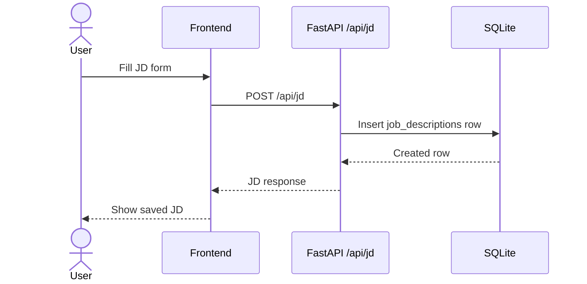
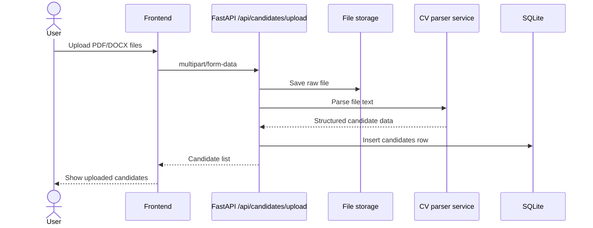
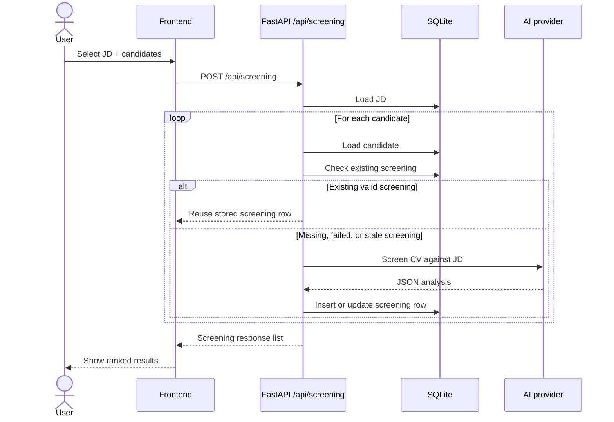
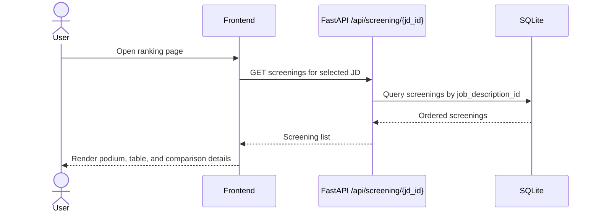
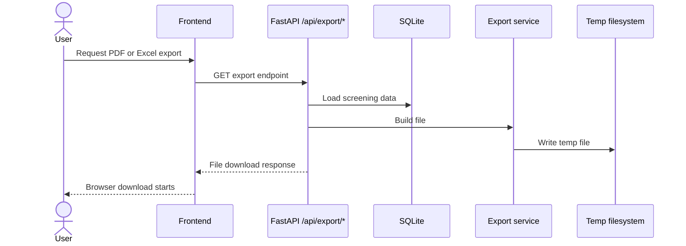

# System Flows

## Core Workflow Summary

The product operates as a recruiter pipeline:

1. create a job description
2. upload candidate CVs
3. run AI screening for selected candidates and one selected JD
4. rank and compare results
5. export reports

## Flow 1: Create Job Description

## Flow 2: Upload Candidate CVs

## Flow 3: Screening Candidates Against a Job Description

## Screening Decision Rules

When the backend receives a screening request:

- it looks up the selected JD once
- it loops over selected candidates
- it reuses an existing screening only when the stored result is still valid
- it refreshes old data when:
  - the previous result failed
  - the previous result came from a different provider/model

## Flow 4: Ranking and Comparison

## Flow 5: Export

## Error Handling Summary

### Upload flow

- rejects unsupported file extensions
- rejects oversized files
- rolls back file write if parsing fails

### Screening flow

- retries retryable AI errors including 429-style rate limits
- spaces requests between candidates using configurable delay
- normalizes failures into structured zero-score results

### Export flow

- returns `404` if the screening/JD selection has no underlying data

## Current UX Implication

The backend is intentionally synchronous:

- one screening request handles one selected JD and many candidates in sequence
- the UI should therefore communicate that batch size affects waiting time
- lighter models reduce timeout and rate-limit pressure
